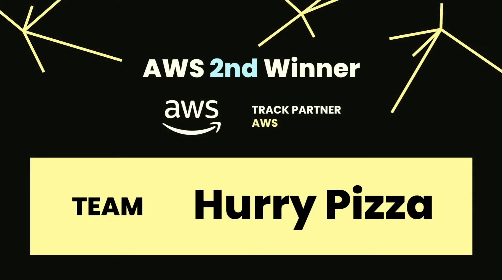
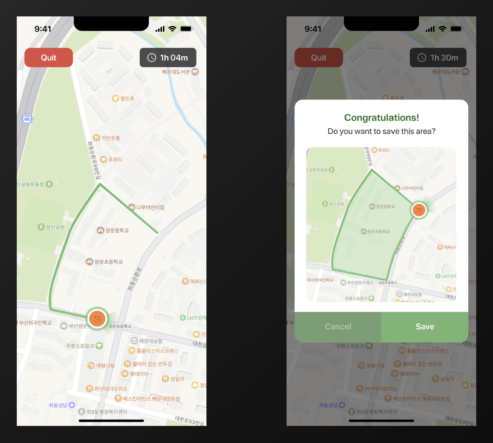
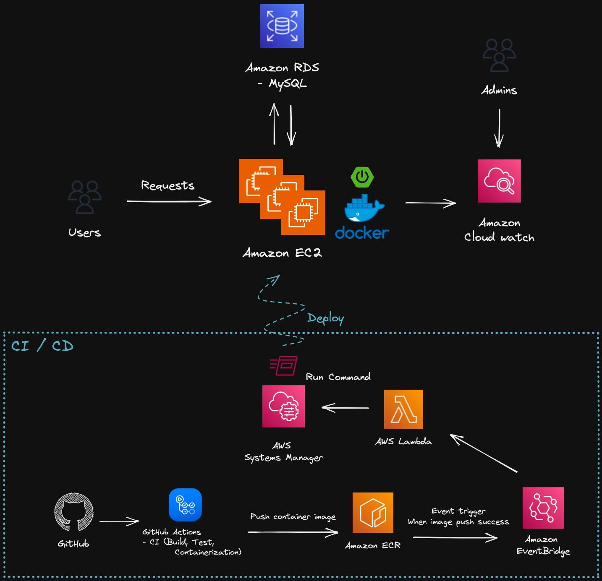
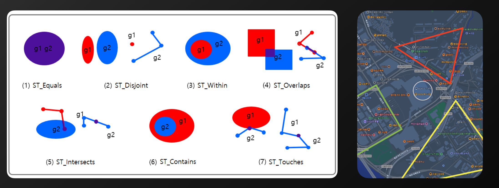
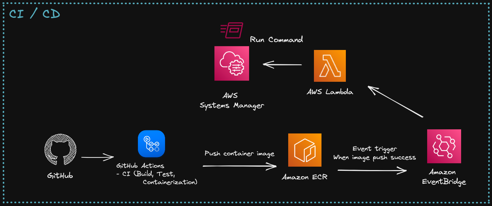

# MINE Server

This project was developed in [Junction Asia](https://asia.hackjunction.com/about) 2022 (AWS Track).



I was awarded `AWS Track Runner-up Finalist (2nd place)` through this project.

<br/>

## Project description



`MINE` is a game in which users create their own land while actually walking using GPS.

<br/>

## Backend architecture



- Amazon EC2, Amazon RDS, Amazon CloudWatch, … for Service.
- Amazon ECR, EventBridge, AWS Lambda, Systems Manager for CI/CD.

<br/>

## Backend tech stack
- JDK 17, Gradle, docker
- Spring boot
    - Spring Web (MVC)
    - Spring security
    - Spring data jpa
- MySQL (8.0)
- Jib (for containerization)
- Swagger, JWT
- AWS
    - Amazon EC2
    - Amazon RDS (MySQL)
    - Amazon CloudWatch
    - Amazon ECR
    - Amazon EventBridge
    - AWS Lambda
    - AWS Systems Manager

<br/>

## Main technique

### Spatial data type, function



I used spatial data type (Point, Polygon, etc.) and spatial operations (ST_Within, etc.) provided by MySQL to calculate the correlation of multiple polygons in the map space.

<br/>

### CI/CD



- [GitHub Actions script](https://github.com/Hurry-Pizza/Mine-Server/blob/master/.github/workflows/push.yml)
- [AWS Lambda script triggered by Amazon EventBridge](https://github.com/Hurry-Pizza/Mine-Server/blob/master/deploy/ssm-lambda.py)
- [Deploy script triggered by AWS Systems Manager](https://github.com/Hurry-Pizza/Mine-Server/blob/master/deploy/deploy.sh)

<br/>

### Stream

```java
var pathsByUserId = pathRepository.findAllByCreatedAtGreaterThanEqual(criteriaDateTime).stream()
                            .collect(Collectors.groupingBy(Path::getUser));
var userByArea = pathsByUserId.entrySet().stream()
                         .collect(Collectors.toMap(e -> e.getValue().stream()
                                              .map(Path::getArea)
                                              .reduce((double) 0, Double::sum), Map.Entry::getKey));
return userByArea.keySet().stream()
               .sorted(Comparator.reverseOrder())
               .map(area -> {
                   var user = userByArea.get(area);
                   return UserRankingInfo.create(user.getId(), user.getNickname(), area);
               })
               .toList();
```

I used Java stream a lot. The above code is an example of a rank logic code.

See [here](https://futurecreator.github.io/2018/08/26/java-8-streams/) for more information on Java stream.
